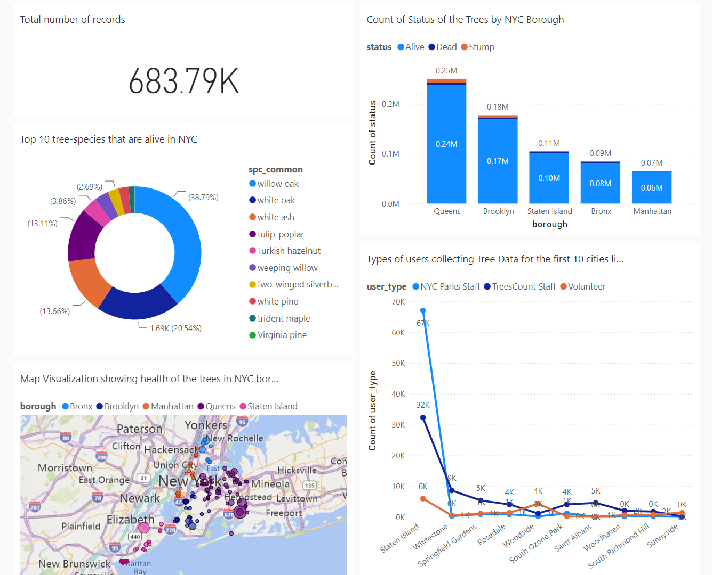

# Data Analyst | Business Analyst | BI Engineer | Data Scientist

#### TECHNICAL SKILLS: Python, R, PostgreSQL, SQLServer, Power BI, Tableau, Java, C++, Machine Learning, Statistical Analysis, ETL

## EDUCATION							       		
- Master of Science, Data Analytics, AI	| Northeastern University (_June 2025_)
- CodePath Technical Interview Prep | (_TIP102, Fall 2025_)			        		
- Bachelor of Engineering, Electronics and Communication Engineering | Visveswaraya Technological University (_Aug 2020_)

## WORK EXPERIENCE
**Data Analyst, Product Manager Intern @IpserLab, Boston, USA (_Sept 2025 - Present_)**
- Collaborated with product managers and engineers in agile sprints to optimize analytics, identify classification biases and perform EDA for an AI trip planner, enhancing model fairness by 15% and improving tracking efficiency by 50%.
- Partnered cross-functionally to manage 40+ analytics and QA initiatives, boosting data accuracy by 25% through SQL/Python validation pipelines and Git-based workflows.

**Business Analyst and BI Intern @AmalgamRx, Delaware, USA (_Sept 2024 - April 2025_)**
- Conducted EDA and correlation analysis on 15M+ patient records using PostgreSQL and Alteryx, identifying procedural delays in Colorectal Cancer Screening workflows in Visio and influencing workflow redesign in provider networks.
- Designed Tableau and LookerStudio dashboards to track KPIs for AI chatbot responses and retention cohorts in an Alzheimer's app, boosting user engagement by 25%, and improving DAU/MAU and funnel conversion rates by 12%.
- Built Tableau dashboards that uncovered trends in a flu vaccine initiative, enabling process improvements that raised vaccine adherence by 15% across a patient population of 120K+.
- Developed data pipelines from APIs and databases into Snowflake on AWS and validated data accuracy in using advanced SQL queries (CTEs, joins, schema validation) and Great Expectations, reducing manual data review by 25+ hours monthly.
- •	Coordinated UAT cycles with product teams to validate changes; scoped and analyzed A/B testing use cases in Excel and Python on 50K+ records to improve provider acceptance rates, cutting clinical decision support errors by 15%.

**Graduate Teaching Assistant @Northeastern University, Boston, USA (_Jan 2024 – June 2024_)**
- Mentored 80+ students on Python, SQL optimization and data modeling; taught EDA best practices and statistical model building, improving project scores by 22% through mentorship, peer code reviews, and Agile practices.
- Developed course materials, graded assignments, and led 12 Scrum sessions, enabling 85% of students to earn an A grade.

**Senior Data Analyst @Infosys Limited, Bangalore, India (_June 2021 - July 2023_)**
- Engineered robust ETL pipelines in Python and SQL to integrate data from 10+ insurance databases into BigQuery, streamlining analytics workflows and saving $100K in yearly operational costs.
- Designed 10+ Power BI dashboards tracking KPIs on client records, claims, customer retention, and web engagement, improving weekly session duration by 12% and raising user retention by 10%.
- Led SQL regression validation for 50+ Redshift database components during a global migration, managing UAT execution and stakeholder sign-offs, achieving 95% data validation accuracy, reducing post-migration defects and preventing ~$250K in SLA penalties.
- •	Coordinated UAT by preparing test cases from user stories and developed Java automation scripts by gathering requirements to validate inbound web API data, reducing QA time by 30+hrs/month and lowering defect rates by 35% in CI/CD data pipelines.
- Served as the analytics lead for two enterprise insurance web apps, driving Agile sprints and consolidating APIs and Redshift data into a Power BI KPI suite that improved dashboard adoption by 40%.
- Deployed time-series forecasting model and ML-based rule validation models (classification & anomaly detection) on claims data, improving fraud/irregularity detection accuracy and cutting manual reviews by 30+ hrs/month.

**Business Analyst, Consultant @IMA Management & Technology, Sydney, Australia (_May 2020 - April 2021_)**
- Facilitated Agile sprint ceremonies by gathering business requirements in JIRA for a corporate website development, consolidating clickstream data from APIs, accelerated requirement turnaround and reduced project cycle time by 30%.
- Performed EDA on Google Analytics data to detect user behavior trends, identifying 40% bounce rates on landing pages and boosted conversions by 18%, generating ~$200K in incremental revenue.
- Migrated 100+ client reports to SharePoint and restructured metadata schemas with custom tagging logic, reducing average search time from 15 minutes to under 2 and enhancing retrieval accuracy by 99%.
- •	Authored detailed user guides/technical documentation, led gap analyses in Excel and Confluence, and delivered actionable recommendations that increased cross-functional project efficiency by 20% and stakeholder satisfaction.

## CERTIFICATIONS
- Oracle Cloud Infrastructure Foundations Associate
- Apache Airflow 3 Fundamentals, Astronormer Certification
- Databricks Fundamentals

## PROJECTS
### Boston BlueBikes Intelligence Dashboard (September 2025 - Present)
- Built comprehensive Tableau dashboard analyzing 1.9M Bluebikes records across 6 monthly datasets, revealing 200.7% seasonal growth pattern from January to June 2025 through interactive visualizations and geographic heat maps.
- Engineered 15+ calculated fields and KPI metrics including ride duration trends, peak hour identification, and station performance metris, enabling data-driven operational insights for Boston's bike-share system.

### ML-Driven Traumatic Brain Injury Digital Phenotyping Platform (April 2025 - June 2025)
[User Dashboard](https://github.com/poorva-pjoshi/Traumatic-Brain-Injury-Digital-Phenotyping-Platform)
- Engineered ETL pipeline to process 187K+ Traumatic Brain Injury’s symptom records, reducing data preparation time by 75% and enabling real-time patient analysis.
- Applied unsupervised ML models like K-Means, DBSCAN & XGBoost to identify patient phenotypes with 87% accuracy.
- Built a React.js website with integrated PowerBI dashboards, allowing providers to identify high-risk patients 40% faster.

### Child Welfare Data Analytics Initiative, XN Project (April 2024 - June 2024)
[Tableau Public](https://public.tableau.com/app/profile/poorva.joshi/vizzes)

- Created dynamic Tableau dashboards for KARA's book "America's Children in 100 Charts", using data visualization techniques to analyze big data from 2015-2022, including the impact of COVID-19 on child abuse reporting and intervention efforts.
- Ensured data accuracy and consistency by addressing missing data from NCANDS, CPS, UNICEF and Kids Count sources during the pandemic, and visualizing critical metrics such as maltreatment types, agency response times, and demographic distributions.

### NYC Tree Health Forecasting, Big Data Management (April 2024 - May 2024)
[Jupyter Notebook](https://github.com/poorva-pjoshi/nyc_tree_health_forecasting_bigdata)

- Built predictive models in PySpark and Python using Decision Tree and Random Forest algorithms to assess urban tree health, achieving 82.096% and 82.685% accuracy, supporting data-driven conservation strategies.
- Developed interactive Tableau and PowerBI dashboards after comprehensive data loading, cleaning, and modeling with Hadoop and PySpark, empowering planners to visualize health determinants and optimize urban green spaces.

### Stay or Stray @ DataScience Hub Hackathon (March 2024 - April 2024)
[Results](https://www.kaggle.com/competitions/stay-or-stray/leaderboard)

- Led a team of 3 members, and secured a Bronze medal among 54 competing teams in a 2-week-long Datathon.
- •	Attained an F1-score of 0.8653 by leveraging advanced machine learning techniques and implementing the data science lifecycle steps to predict student dropout rates from courses.

### NYC Crime Dynamics Dashboard, Data Visualization (Jan 2024 - March 2024)
[Tableau Public](https://public.tableau.com/app/profile/poorva.joshi/viz/NYCCrimesin2023/NYCCrimeStory)

-  Developed multiple interactive Tableau dashboards and compelling data stories for NYC crime data, enhancing data-driven decision-making for policymakers and law enforcement by visualizing key crime trends and demographics.
-  Reduced analysis time by 40% through the implementation of automated data visualizations, allowing quicker identification of crime hotspots and demographic patterns.

### Airline Passenger Satisfaction, Intermediate Analytics (Jan 2024 - Feb 2024)
[R Code](https://github.com/poorva-pjoshi/airline_passenger_satisfaction)

- The project involved a comprehensive statistical analysis aimed at understanding airline customer satisfaction and predicting flight distances. Team members collaborated to perform exploratory data analysis (EDA), data cleaning, transformation, and visualization using R.
- Contributed to various aspects of the analysis, including interpreting descriptive statistics, correlation analysis, and implementing regression models to evaluate performance and gain valuable insights.
- The project's goal was to provide actionable recommendations for enhancing customer experience and informing strategic decision-making in the aviation sector.

### Event Management System, DBMS (Sept 2023 - Oct 2023)
[PDF](/assets/DBMS_EventManagementSystem.pdf)

-  Developed a sophisticated event management system, featuring a meticulously designed relational database using ERD techniques.
-  Successfully created a seamless attendee registration and speaker coordination process by using MySQL.

### Exploratory Analysis and Hypothesis Testing on Government Awards Dataset (Oct 2023 - Nov 2023)
[PPT](assets/Probability_And_Statistics.pptx)

- Spearheaded exploratory data analysis and hypothesis testing on a government awards dataset, uncovering valuable insights into award distributions, company demographics, and regional variations in award amounts.
- Led a team in conducting statistical analyses, including t-tests and linear regression modeling, to investigate factors influencing award amounts and assess differences between socially disadvantaged and advantaged companies across states, Georgia and Tennessee.
- Additionally, utilized data visualization techniques such as bar plots, box plots, and heatmaps to communicate findings effectively.
